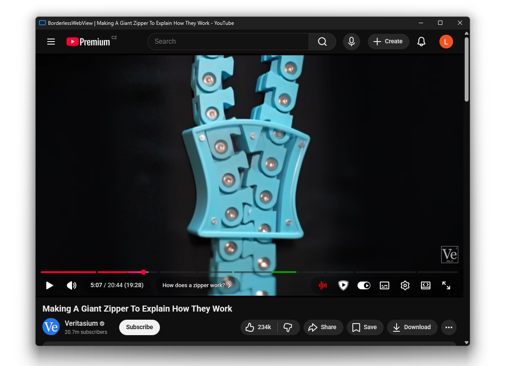
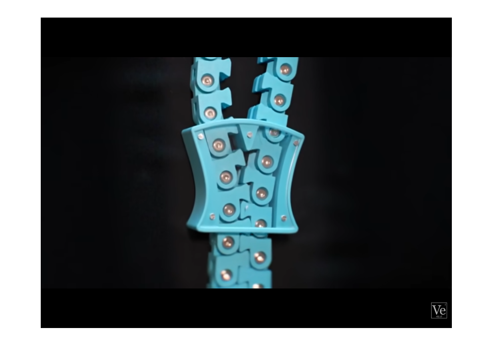

# BorderlessWebView

Chrome companion app for playing videos in borderless window.

I'm using a big 55" OLED TV as a monitor and sometimes I want to watch videos in a smaller window, but the browser borders are distracting. That's why I made this app.

This is supposed to be a minimal single purpose app, not a full web browser replacement, so there are no buttons and address bar, but there is extensions support.

App screenshot             | "Fullscreen" screenshot
:-------------------------:|:-------------------------:
 | 

## Installation

### 1) App installation 
- Download the latest release
- Extract all files somewhere, for example in `C:/BorderlessWebView` or `C:/Users/yourname/BorderlessWebView` (I'll be referring to this path as `${AppLocation}`)
- Run `install.exe`

### 2) Extension installation
- Open `chrome://extensions`
- Enable `Developer mode` toggle
- Click `Load unpacked`
- Select the `chrome-extension` folder where you extracted the app files, in `${AppLocation}/chrome-extension`

## Usage

### Using the app
Click on the BorderlessWebView extension in the extensions dropdown menu, or pin the extension in your Chrome toolbar and have it directly next to the address bar. This will open the website in your active tab in BorderlessWebView app.

Then just put the video into fullscreen - it will fill the app window and remove borders, but it won't fill your entire screen.

The app will also remember your logged in accounts, the data is stored in `${AppLocation}/UserData`.

### Installing extensions
BorderlessWebView supports regular extensions like SponsorBlock etc. Chrome extension store is not supported, you need to obtain the `.crx` manually. Put the downloaded `.crx` file into `${AppLocation}/Extensions`, it will load automatically on the next app start. You can use **Ctrl + E** to go into extensions settings.

### Keyboard shortcuts
- **Ctrl + E**: show list of extensions, if you need to open extension settings
- **Ctrl + T**: toggle "always on top"
- **Ctrl + W**: close window

## Uninstallation
- Run `uninstall.exe`
- Delete all app files

## Building
You can build just the `Packaging` project, it will build all necessary parts and create a ready to use folder in `Packaging/bin/(Release|Debug)/dist`
